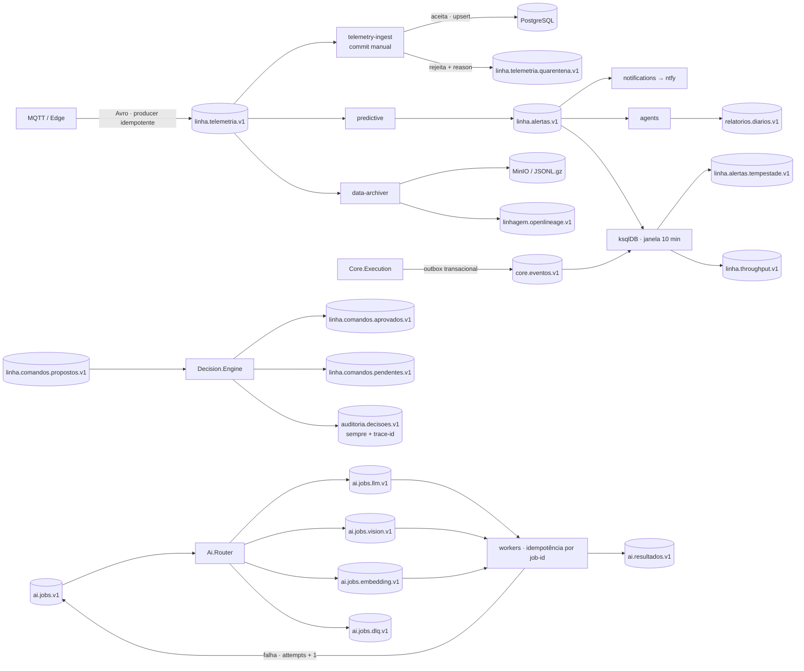
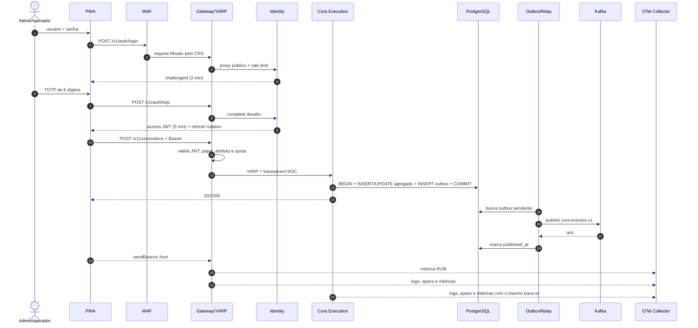
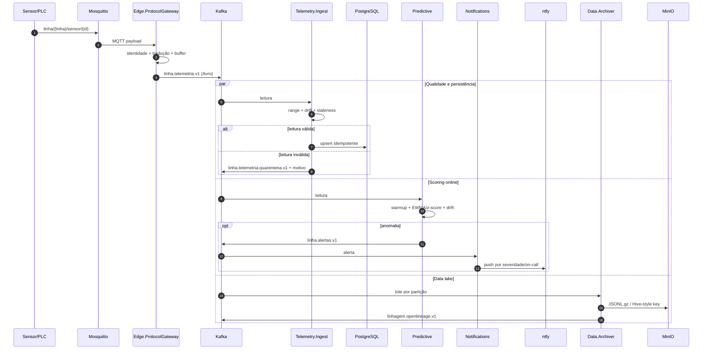
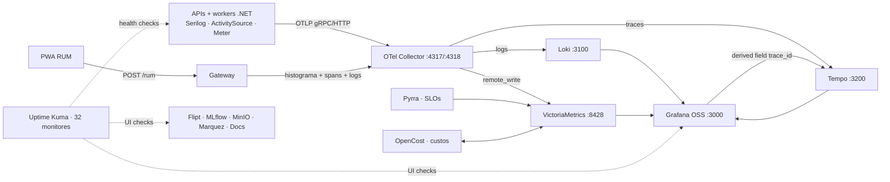
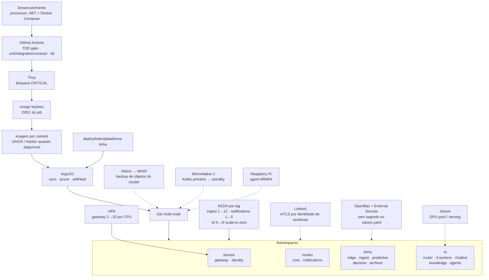

<header className="architecture-masthead">
  
Arquitetura viva · validada contra o código em 14/07/2026

  <h1>Observabilidade de ponta a ponta, do clique do usuário ao registro no banco</h1>
  

    O fluxo implementado começa na <strong>PWA com login em duas etapas</strong>, atravessa o
    <strong> Gateway .NET com JWT, RBAC/ABAC e rate limit</strong>, chega às APIs e aos workers de domínio,
    e persiste em <strong>PostgreSQL/pgvector, Valkey, VictoriaMetrics e MinIO</strong>. Em paralelo, a borda
    industrial traduz MQTT para Avro e publica no mesmo Kafka usado pelos pipelines preditivo, de decisão,
    notificações, arquivamento, linhagem e IA. Logs, traces e métricas convergem no mesmo OpenTelemetry Collector.
  

  

    
<strong>17</strong>processos da aplicação ativos

    
<strong>24</strong>serviços Compose ativos

    
<strong>16</strong>workloads no Helm chart

    
<strong>32</strong>monitores no Uptime Kuma

  

  

    <i className="legend-dot client-dot"></i>Cliente
    <i className="legend-dot access-dot"></i>Acesso / Gateway
    <i className="legend-dot edge-dot"></i>Borda industrial
    <i className="legend-dot service-dot"></i>Serviços .NET
    <i className="legend-dot ai-dot"></i>IA assíncrona
    <i className="legend-dot data-dot"></i>Dados
    <i className="legend-dot obs-dot"></i>Observabilidade
  

  

    OK LOCAL
    <strong>Execução nesta estação:</strong> PWA, Gateway, cinco APIs, dez workers, Kafka, PostgreSQL HA,
    Valkey, MinIO, Mosquitto e o stack Grafana estão ativos. Docker Compose cuida da infraestrutura;
    os hosts .NET rodam como processos locais instrumentados.
  

  

    OK CÓDIGO
    <strong>Interfaces:</strong> o core Web/PWA e os shells Tauri Desktop estão versionados.
    AGUARDA SDK O empacotamento Mobile continua dependente do Android SDK/NDK.
  

  

    OK CONFIG
    <strong>Cluster:</strong> Helm, ArgoCD, namespaces, HPA, KEDA, Linkerd, External Secrets/OpenBao,
    Velero e MirrorMaker 2 estão declarados. A execução distribuída aguarda os nós k3s/Jetson.
  

  

    SEM SAAS PAGO
    <strong>Operação self-hosted:</strong> Flipt substitui o Unleash, MLflow registra modelos,
    Marquez apresenta linhagem, MinIO mantém o lake e Grafana OSS concentra a operação.
  

</header>

## Como ler os selos

| Selo | Significado objetivo |
|---|---|
| OK LOCAL | Serviço ou fluxo verificado em execução nesta máquina. |
| OK CÓDIGO | Implementação e testes existem no monorepo; pode depender de outro processo para produzir carga. |
| OK CONFIG | Manifest, chart ou runbook está pronto, mas não está ativo nesta estação. |
| AGUARDA HARDWARE | Depende de GPU, Android SDK/NDK ou dos outros nós do cluster. |
| LACUNA | O próprio código mostra um elo ainda não fechado; está exposto aqui para não virar promessa implícita. |

## Mapa completo da implementação

  

    PÁGINA SEPARADA
    <h3>Explore a plataforma inteira em uma visão expandida</h3>
    
Clientes, APIs, edge, Kafka, IA, dados, observabilidade e GitOps agora vivem em uma página própria, com espaço para navegar horizontalmente sem comprimir a documentação.

  

  <a className="map-page-link" href="./mapa-implementacao">Abrir mapa completo →</a>

## Status por bloco e evidência no código

| Bloco | Status | Como foi implementado | Fonte da verdade |
|---|---|---|---|
| Cliente principal | OK LOCAL | PWA estática, login senha→TOTP, token em memória, service worker sem cache em `/v1/**`, RUM por `sendBeacon`. | `clients/pwa/` |
| Shell Desktop | OK CÓDIGO | Tauri carrega o mesmo core Web com CSP liberando apenas HTTP(S)/WS(S) necessários. | `clients/desktop/src-tauri/` |
| Shell Mobile | AGUARDA SDK | Alvo e fluxo de empacotamento documentados; falta gerar/assinar o binário com Android SDK/NDK. | `clients/mobile/README.md` |
| Cliente de observabilidade | OK CÓDIGO | PWA/Tauri com desbloqueio TOTP local e Grafana embutido; shell independente do cliente operacional. | `clients/observability/` |
| WAF | OK LOCAL | NGINX + ModSecurity + OWASP CRS em modo de bloqueio, proxy para o Gateway. | `docker-compose.yml` perfil `waf` |
| Gateway/BFF | OK LOCAL | YARP, JWT simétrico ou JWKS Keycloak, RBAC/ABAC, multi-tenant opcional, rota negada por padrão, rate limit Valkey/local e RUM. | `src/Gateway/` |
| Identity | OK LOCAL | Desafio de 2 min, TOTP RFC 6238 com janela ±1 e proteção de replay, access token de 5 min, refresh rotativo com revogação da família. | `src/Identity/` |
| Core.Execution | OK LOCAL | Máquina de estados de ordem; agregado e outbox gravados na mesma transação; relay idempotente para Kafka. | `src/Core.Execution/` |
| Edge.ProtocolGateway | OK LOCAL | Assina `linha/+/sensor/+`, traduz payload, valida identidade do dispositivo, usa buffer store-and-forward e produz Avro. | `src/Edge.ProtocolGateway/` |
| Quality gate | OK LOCAL | Valida faixa física, drift de relógio e staleness; aceita em Postgres ou publica em quarentena com motivo. | `src/Telemetry.Ingest/` |
| Predictive | OK LOCAL | EWMA/z-score online, warmup, baseline protegido contra anomalia, monitor de drift e publicação de alerta. | `src/Predictive/` |
| Notifications | OK LOCAL | Consome alertas com commit manual, decide escala on-call e envia push ntfy. E-mail ainda é log estruturado. | `src/Notifications/` |
| Decision Engine | OK LOCAL | Envelope operacional, degrau máximo, criticidade e aprovação humana; todo desfecho gera auditoria com trace-id. | `src/Decision.Engine/` |
| Chatbot/MCP | OK LOCAL | RAG com visibilidade RBAC, REST e servidor MCP na mesma API, ferramentas destrutivas com `always_ask`. | `src/Chatbot/` |
| Knowledge | OK LOCAL | HotChocolate GraphQL autenticado, chunking, embeddings, JSONB, pgvector/HNSW e filtro de visibilidade na query. | `src/Knowledge/` |
| Agents | OK LOCAL | Janela de sinais, diagnóstico de incidente, relatório diário no Kafka e proposta de ação protegida. | `src/Agents/` |
| IA assíncrona | OK PROCESSOS | Router por tipo, três workers, ledger idempotente, retry via tópico raiz e DLQ após limite de tentativas. | `src/Ai/` |
| Serving de IA | AGUARDA GPU | Contratos HTTP OpenAI-compatible prontos; `llama.cpp` para Nano e vLLM para Orin declarados no deploy Jetson. | `deploy/jetson/` |
| Data lake | OK LOCAL | Lê Kafka por partição, compacta JSONL.gz, grava no MinIO com chave Hive-style e emite OpenLineage. | `src/Data.Archiver/` |
| Contratos | OK LOCAL | Seis schemas Avro versionados; codec binário executável; Apicurio registra os artefatos de forma idempotente. | `schemas/`, `src/Platform/Platform.Contracts/` |
| Observabilidade | OK LOCAL | Serilog + OTel em todos os hosts; Collector separa logs→Loki, traces→Tempo e métricas→VictoriaMetrics; Grafana correlaciona por `trace_id`. | `src/Platform/Platform.ServiceDefaults/`, `deploy/observability/` |
| SLO/FinOps/status | OK LOCAL | Pyrra lê SLOs versionados, OpenCost usa a API Prometheus e Uptime Kuma executa 32 verificações. | `deploy/observability/slo/`, `docker-compose.yml` |
| GitOps e autoscale | OK CONFIG | Chart com namespaces, resources, HPA e KEDA por lag; ArgoCD com sync, prune e self-heal. | `deploy/helm/`, `deploy/argocd/` |
| mTLS e segredos | OK CONFIG | Linkerd por injeção de proxy; External Secrets lê OpenBao; `PlatformSecrets` dá fallback explícito para dev. | `deploy/cluster/`, `src/Platform/Platform.ServiceDefaults/` |
| DR | OK CONFIG | Replica PostgreSQL, WAL archive e dump já rodam localmente; Velero, MirrorMaker 2 e failover cross-region estão versionados. | `deploy/dr/`, `docs/governanca/` |

## Rotas HTTP implementadas

O Gateway só encaminha prefixos presentes simultaneamente na configuração YARP e na tabela de autorização.

| Entrada | Destino | Política | Implementação relevante |
|---|---|---|---|
| `/v1/auth/**` | Identity | Pública, protegida pelo rate limit | login, TOTP, refresh e provisionamento TOTP |
| `/v1/core/**` | Core.Execution | `operador` ou `admin`; `/admin` exige `admin` | ordens e transições de produção |
| `/v1/chat/**` | Chatbot | `operador` ou `admin` | chat, ferramentas e MCP |
| `/v1/knowledge/**` | Knowledge | `operador` ou `admin` | GraphQL com filtro RBAC |
| `/v1/agents/**` | Agents | `operador` ou `admin` | diagnóstico, relatório e proposta de ação |
| `/rum` | Gateway | Pública, payload limitado | histograma `client.rum.duration` |
| `/healthz` | Cada host HTTP | Pública | liveness sintético |
| `/v1/linha/**` | Sem cluster YARP hoje | LACUNA | a política autoriza e a PWA tenta `/v1/linha/ws`, mas não há backend WebSocket mapeado |

## Tópicos Kafka e garantias

| Garantia | Onde aparece |
|---|---|
| **At-least-once controlado** | Consumers desativam auto-commit e confirmam só após persistir, publicar ou reenfileirar. |
| **Outbox transacional** | `WorkOrderStore` grava estado e evento na mesma transação PostgreSQL; `OutboxRelay` publica depois. |
| **Idempotência de telemetria** | Chave `(sensor_id, measured_at)` e `ON CONFLICT DO NOTHING`. |
| **Idempotência de IA** | `IdempotencyLedger` impede resultado duplicado por `job-id`; em cluster o próximo passo é `SET NX` no Valkey. |
| **Falha explícita** | Quarentena para telemetria, DLQ para IA, pending para decisão humana e métricas para outbox/ingest. |
| **Contrato versionado** | `.avsc` no repositório, codec em `Platform.Contracts` e publicação no Apicurio. |

## Sequência: clique até o banco e o trace

## Sequência: fábrica, qualidade, predição e alerta

## Observabilidade e operação local

O `Platform.ServiceDefaults` padroniza `service.name`, logs estruturados, `ActivitySource`, `Meter` e exportação
OTLP. O mascaramento de PII cobre nomes conhecidos como senha, CPF, telefone e seed TOTP antes do sink.
No Grafana, o datasource Loki extrai `trace_id` e abre o trace correspondente no Tempo.

## Interfaces locais

Credencial administrativa de desenvolvimento: **`msuchoa` / `w1ntersun`**. Ela não deve ser reutilizada fora deste ambiente.

| Sistema | URL | Status | Para que serve | Acesso local |
|---|---|---|---|---|
| PWA operacional | [127.0.0.1:8081](http://127.0.0.1:8081/) | OK LOCAL | Operação da linha, autenticação e RUM | admin + TOTP |
| Uptime Kuma | [127.0.0.1:3001](http://127.0.0.1:3001/dashboard) | OK LOCAL | Saúde sintética dos 32 endpoints | admin |
| Grafana OSS | [127.0.0.1:3000](http://127.0.0.1:3000/) | OK LOCAL | Logs, traces, métricas e FinOps | anônimo admin em dev; admin disponível |
| Flipt | [127.0.0.1:4242](http://127.0.0.1:4242/) | OK LOCAL | Feature flags self-hosted | sem login no perfil dev |
| Marquez Web | [127.0.0.1:3012](http://127.0.0.1:3012/) | OK LOCAL | Grafo de linhagem OpenLineage | sem login no perfil dev |
| MLflow | [127.0.0.1:5500](http://127.0.0.1:5500/) | OK LOCAL | Experimentos, artefatos e registro de modelos | sem login no perfil dev |
| MinIO Console | [127.0.0.1:9001](http://127.0.0.1:9001/login) | OK LOCAL | Lake S3 e inspeção do bucket `linha-lake` | admin |
| Docs | [127.0.0.1:3003](http://127.0.0.1:3003/docs/arquitetura) | OK LOCAL | Arquitetura e governança versionadas | sem login no perfil dev |
| OpenCost | [127.0.0.1:9003](http://127.0.0.1:9003/) | OK LOCAL | Custos e eficiência de recursos | sem login no perfil dev |
| Pyrra | [127.0.0.1:9099](http://127.0.0.1:9099/) | OK LOCAL | SLOs e error budgets | sem login no perfil dev |
| Apicurio | [127.0.0.1:8085](http://127.0.0.1:8085/) | OK LOCAL | Catálogo e versões dos contratos Avro | sem login no perfil dev |
| ksqlDB | [127.0.0.1:8088](http://127.0.0.1:8088/info) | OK LOCAL | Stream SQL e janelas contínuas | API local |
| ntfy | [127.0.0.1:8090](http://127.0.0.1:8090/) | OK LOCAL | Push self-hosted para alertas | sem login no perfil dev |

## Deploy: do desenvolvimento ao cluster

O chart declara requests/limits e escaladores por workload. O Gateway usa HPA por CPU; consumers usam KEDA por
lag do tópico; LLM, visão e embeddings começam em zero réplicas. `mesh.enabled` injeta Linkerd sem alterar as APIs,
e os segredos chegam por External Secrets, não pelo `values.yaml`.

## Lacunas reais, agora explícitas

| Item | Estado atual | Para fechar |
|---|---|---|
| WebSocket da linha | LACUNA A PWA abre `/v1/linha/ws`, mas o YARP não possui rota/cluster nem há host WebSocket no monorepo. | Implementar o hub/bridge de telemetria e mapear a rota no Gateway. |
| Marquez ingest | LACUNA Data.Archiver publica `linhagem.openlineage.v1`; Marquez API/UI estão ativos, porém não existe bridge Kafka→OpenLineage HTTP. | Adicionar consumer que poste os `RunEvent` no endpoint Marquez. |
| E-mail real | FASE ATUAL O canal e-mail gera log estruturado; ntfy é o envio real. | Integrar relay SMTP interno mantendo a mesma interface `EmailSender`. |
| Idempotência IA distribuída | FASE ATUAL Ledger é em memória por processo. | Trocar por `Valkey SET NX` com TTL para múltiplas réplicas. |
| LLM/visão/embeddings reais | AGUARDA GPU Workers estão vivos, mas o serving precisa da Jetson. | Subir um dos perfis em `deploy/jetson/` e apontar as três URLs. |
| Mobile | AGUARDA SDK Arquitetura e shell estão documentados, sem APK/IPA gerado aqui. | Instalar SDK/NDK, inicializar o target Tauri Mobile e assinar o artefato. |
| Cluster/DR cross-region | OK CONFIG Scripts, manifests e runbook estão prontos; não há segunda região nesta estação. | Executar bootstrap dos nós, game day e medir RPO/RTO real. |
| Eval automatizada de IA | BACKLOG Critérios estão documentados, sem gate executável no CI. | Transformar `docs/governanca/avaliacao-ia.md` em suíte de regressão. |

## Decisões que o código já tomou

- **Single-tenant por instância é o padrão.** Multi-planta usa atributo ABAC; multi-tenant no mesmo cluster só entra com `MultiTenant:Enabled` e `X-Tenant` obrigatório.
- **A borda autoriza antes de encaminhar.** Prefixo mais específico vence e rota não listada retorna 404; autenticação, autorização e rate limit acontecem antes do YARP.
- **Nenhum caminho de falha importante é silencioso.** Há quarentena, DLQ, pending humano, backpressure, retry contado, outbox com métrica e SLO versionado.
- **O contrato do evento é código.** Os `.avsc` documentam; `Platform.Contracts` executa o wire format; Apicurio cataloga e versiona.
- **Observabilidade não é sidecar opcional da regra de negócio.** O `ServiceInstrumentation` entra em cada host e o `traceparent` atravessa Gateway, serviços e mensagens.
- **Dados quentes e frios têm destinos diferentes.** PostgreSQL/Valkey atendem o operacional; MinIO recebe lotes compactados e particionados; VictoriaMetrics atende série temporal e métricas.
- **Autoscale segue a causa da carga.** HTTP escala por CPU; consumidor escala por lag; GPU escala de zero quando chega job.
- **O ambiente local é deliberadamente simples.** Processos .NET falam com a infraestrutura Compose; o mesmo contrato de configuração alimenta os manifests do cluster.
