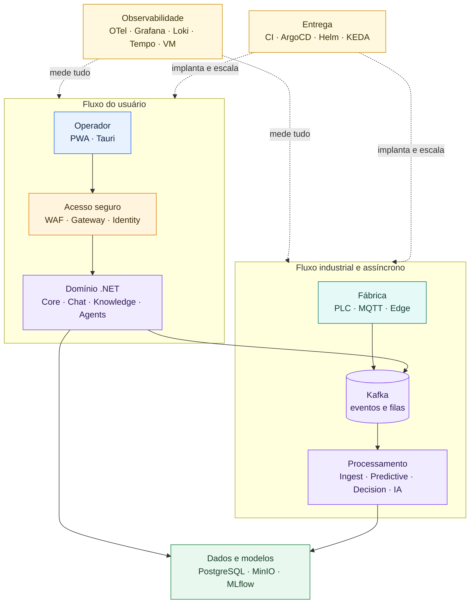
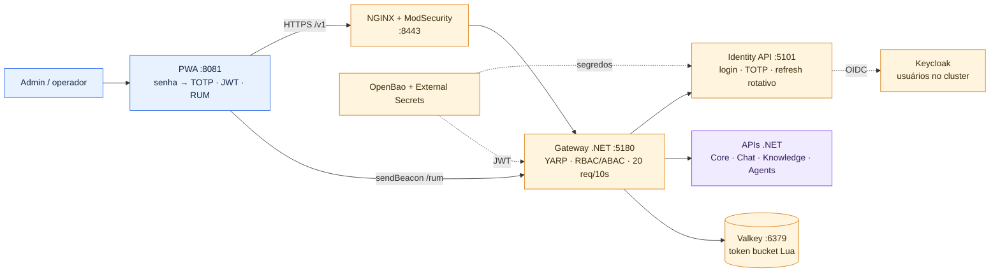
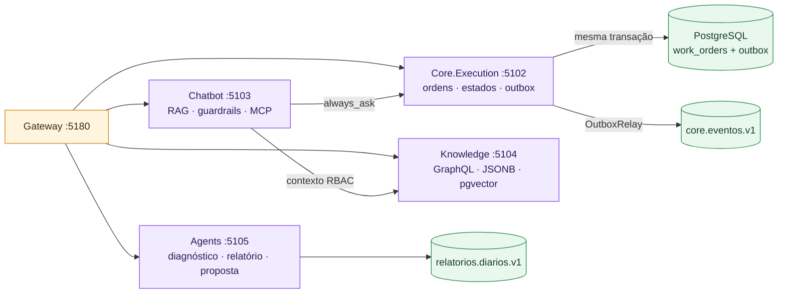
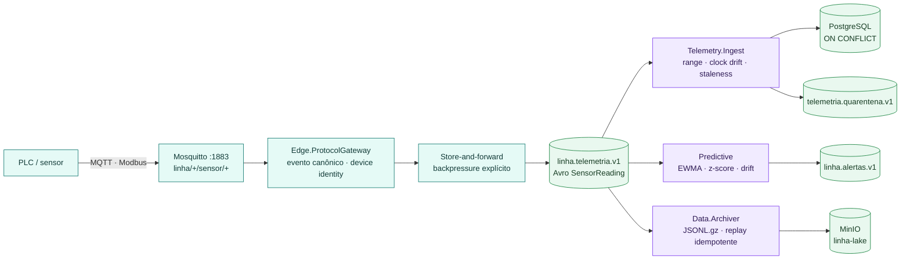
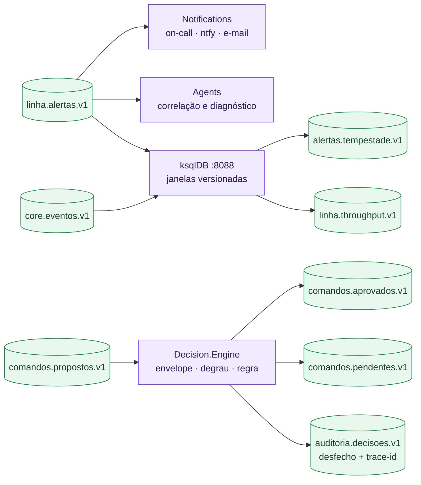
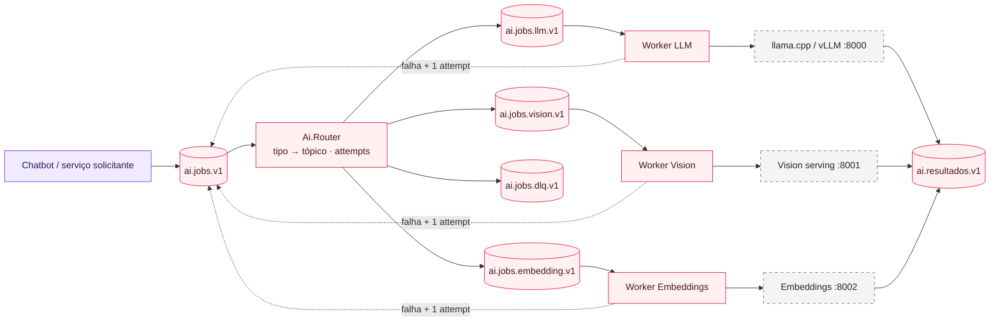
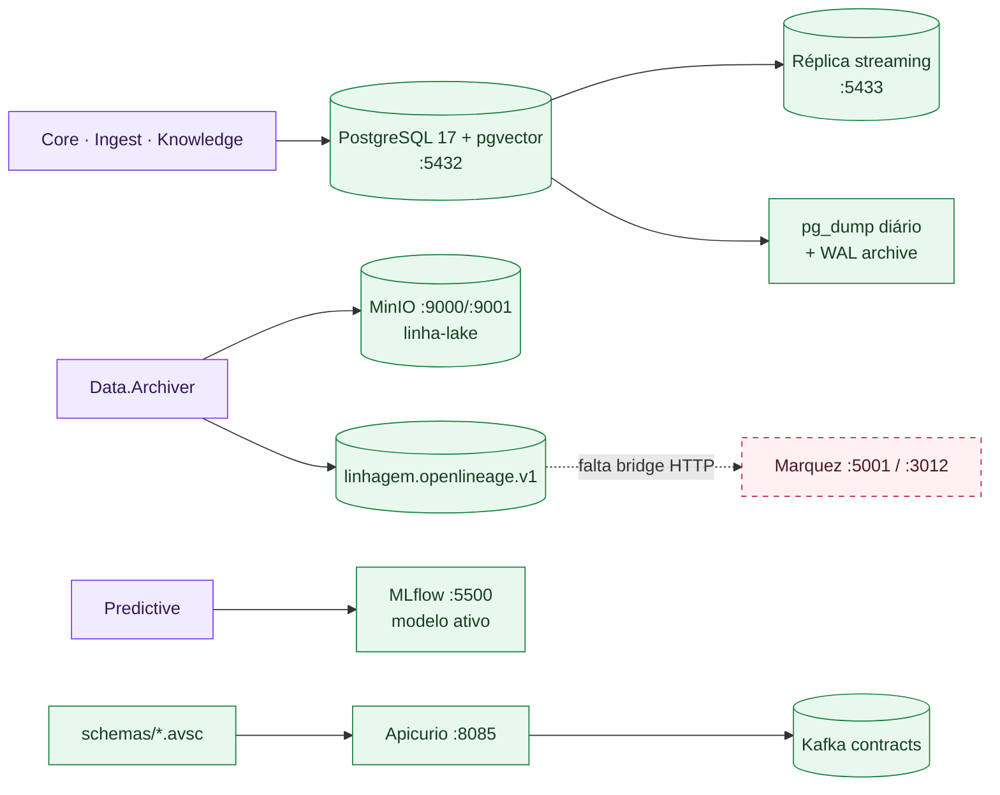
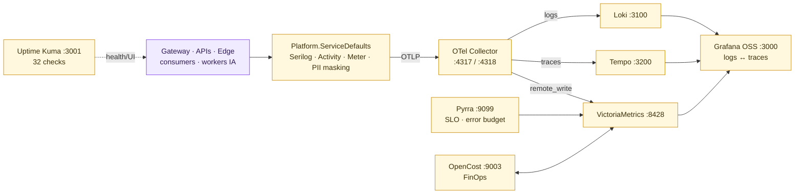
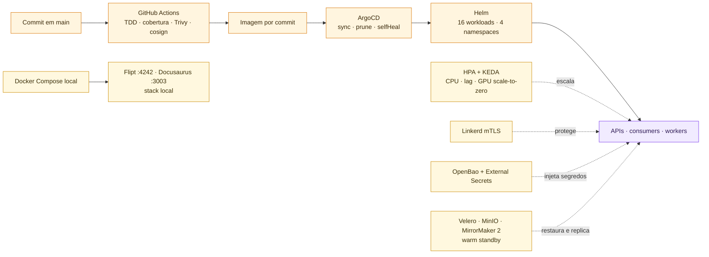

<header className="map-page-header">
  
Visão técnica expandida · validada contra o código em 14/07/2026

  <h1>Mapa completo da implementação</h1>
  

    Clientes, acesso, APIs, edge industrial, tópicos Kafka, consumers, IA, stores, observabilidade e entrega
    GitOps em uma única visão. Linhas contínuas representam fluxos implementados; linhas tracejadas representam
    configuração pronta, dependência externa ou integração ainda parcial.
  

  <a className="map-back-link" href="./arquitetura">← Voltar para a arquitetura detalhada</a>
</header>

  <i className="legend-dot client-dot"></i>Cliente
  <i className="legend-dot access-dot"></i>Acesso / Gateway
  <i className="legend-dot edge-dot"></i>Borda industrial
  <i className="legend-dot service-dot"></i>Serviços .NET
  <i className="legend-dot ai-dot"></i>IA assíncrona
  <i className="legend-dot data-dot"></i>Dados
  <i className="legend-dot obs-dot"></i>Observabilidade

<nav className="map-section-nav" aria-label="Níveis de leitura do mapa">
  <a href="#visao-macro">Visão macro</a>
  <a href="#paineis-tecnicos">Painéis técnicos</a>
  <a href="#mapa-completo">Mapa completo</a>
</nav>

<section className="diagram-panel diagram-panel--macro" id="visao-macro">
  

    

      MACRO
      

        <h2>Visão macro da plataforma</h2>
        
O caminho principal em uma leitura: quem entra, onde a regra roda, como os eventos circulam, onde os dados ficam e como tudo é operado.

      

    

    <DiagramDownload filename="plataforma-visao-macro" />
  

  

    <strong>Fluxo principal</strong>
    Cliente → acesso → serviços → Kafka → processamento → dados
    Observabilidade e GitOps atravessam todas as etapas.
  

</section>

  DETALHE PROGRESSIVO
  <h2>Painéis técnicos por domínio</h2>
  
Cada painel isola um contexto operacional. As conexões externas aparecem apenas como entrada ou saída, para manter portas, contratos e responsabilidades legíveis.

<section className="diagram-panel" id="clientes-acesso">
  

    

      01
      

        <h2>Clientes, identidade e acesso HTTP</h2>
        
Login, TOTP, autorização, proteção de borda, limitação distribuída e roteamento público.

      

    

    <DiagramDownload filename="01-clientes-identidade-acesso" />
  

</section>

<section className="diagram-panel" id="servicos-dotnet">
  

    

      02
      

        <h2>Serviços de aplicação .NET</h2>
        
Responsabilidades síncronas, chamadas autorizadas e a fronteira transacional entre banco e eventos.

      

    

    <DiagramDownload filename="02-servicos-dotnet" />
  

</section>

<section className="diagram-panel" id="edge-eventos">
  

    

      03
      

        <h2>Edge industrial e ingestão de telemetria</h2>
        
Do protocolo de fábrica ao evento canônico, com buffer, validação, persistência e detecção preditiva.

      

    

    <DiagramDownload filename="03-edge-ingestao-telemetria" />
  

</section>

<section className="diagram-panel" id="decisoes-streaming">
  

    

      04
      

        <h2>Alertas, decisões e streaming contínuo</h2>
        
Escalonamento operacional, aprovação humana, auditoria e agregações contínuas no Kafka.

      

    

    <DiagramDownload filename="04-alertas-decisoes-streaming" />
  

</section>

<section className="diagram-panel" id="ia-assincrona">
  

    

      05
      

        <h2>Subsistema assíncrono de IA</h2>
        
Roteamento por modalidade, workers idempotentes, serving em GPU, retry controlado e DLQ.

      

    

    <DiagramDownload filename="05-subsistema-ia-assincrona" />
  

</section>

<section className="diagram-panel" id="dados-linhagem">
  

    

      06
      

        <h2>Persistência, lake, modelos e linhagem</h2>
        
Dados quentes, recuperação, objetos frios, schemas, experimentos e o ponto ainda pendente da linhagem.

      

    

    <DiagramDownload filename="06-dados-lake-modelos-linhagem" />
  

</section>

<section className="diagram-panel" id="observabilidade">
  

    

      07
      

        <h2>Espinha de observabilidade</h2>
        
Uma emissão OTLP comum para logs, traces e métricas, com correlação, SLO, custo e checks sintéticos.

      

    

    <DiagramDownload filename="07-espinha-observabilidade" />
  

</section>

<section className="diagram-panel" id="plataforma-entrega">
  

    

      08
      

        <h2>Plataforma, segurança e entrega</h2>
        
Do commit assinado ao workload escalável, com GitOps, mTLS, segredos e recuperação de desastre.

      

    

    <DiagramDownload filename="08-plataforma-seguranca-entrega" />
  

</section>

<section className="diagram-panel diagram-panel--complete" id="mapa-completo">
  

    

      FULL
      

        <h2>Mapa integral de implementação</h2>
        
Referência de engenharia com todos os serviços, portas, tópicos, stores, estados e integrações em uma única prancha.

      

    

    <DiagramDownload filename="plataforma-mapa-completo" />
  

</section>

```mermaid
flowchart TB
  subgraph USERS["Pessoas e clientes"]
    ADMIN["Admin / operador"]
    PWA["OK LOCAL · PWA :8081<br/>clients/pwa<br/>senha → TOTP · SW · RUM"]
    DESKTOP["OK CÓDIGO · Tauri Desktop<br/>clients/desktop"]
    MOBILE["AGUARDA SDK · Tauri Mobile<br/>clients/mobile"]
    OBSCLIENT["OK CÓDIGO · Cliente de observabilidade<br/>Web/PWA + Tauri · TOTP local"]
    ADMIN --> PWA
    ADMIN -. empacotamento .-> DESKTOP
    ADMIN -. empacotamento .-> MOBILE
    ADMIN --> OBSCLIENT
  end

  subgraph ACCESS["Acesso, identidade e borda HTTP"]
    WAF["OK LOCAL · NGINX + ModSecurity CRS :8443<br/>perfil waf"]
    GW["OK LOCAL · Gateway .NET :5180<br/>YARP · JWT · RBAC/ABAC · rate limit 20/10s<br/>deny-by-default · traceparent · /rum"]
    ID["OK LOCAL · Identity API :5101<br/>/login · /totp · /refresh<br/>TOTP RFC 6238 · refresh rotativo"]
    KEYCLOAK["OK CONFIG · Keycloak<br/>fonte de usuários/OIDC no deploy Pi"]
    OPENBAO["OK CONFIG · OpenBao + External Secrets<br/>JWT, TOTP seed e credenciais"]
    VALKEY["OK LOCAL · Valkey :6379<br/>token bucket Lua distribuído"]
    PWA -->|"HTTPS /v1/* · JWT"| WAF
    WAF --> GW
    GW -->|"proxy público /v1/auth/*"| ID
    GW -->|"rate limit distribuído"| VALKEY
    ID -. "OIDC/password grant quando configurado" .-> KEYCLOAK
    OPENBAO -. "PlatformSecrets / ExternalSecret" .-> ID
    OPENBAO -. "chave JWT" .-> GW
    PWA -->|"sendBeacon /rum"| GW
  end

  subgraph APIS["APIs síncronas .NET"]
    CORE["OK LOCAL · Core.Execution :5102<br/>ordens + máquina de estados<br/>agregado e outbox na mesma transação"]
    CHAT["OK LOCAL · Chatbot :5103<br/>RAG · guardrails · REST + MCP"]
    KNOW["OK LOCAL · Knowledge :5104<br/>GraphQL autenticado · JSONB + pgvector<br/>filtro RBAC na consulta"]
    AGENTS["OK LOCAL · Agents :5105<br/>correlação · diagnóstico · relatório diário<br/>proposta de ação protegida"]
    GW -->|"/v1/core/* operador/admin"| CORE
    GW -->|"/v1/chat/* operador/admin"| CHAT
    GW -->|"/v1/knowledge/* operador/admin"| KNOW
    GW -->|"/v1/agents/* operador/admin"| AGENTS
    CHAT -->|"contexto autorizado"| KNOW
    CHAT -->|"ferramenta com always_ask"| CORE
  end

  subgraph EDGE["Linha industrial / edge"]
    SENSOR["PLC / sensor / dispositivo"]
    MQTT["OK LOCAL · Mosquitto :1883<br/>linha/+/sensor/+"]
    EDGEGW["OK LOCAL · Edge.ProtocolGateway<br/>Modbus/MQTT → evento canônico<br/>identidade do device + OTA policy"]
    BUFFER["OK CÓDIGO · store-and-forward<br/>capacidade explícita · backpressure"]
    SENSOR -->|"MQTT / Modbus"| MQTT
    MQTT --> EDGEGW
    EDGEGW --> BUFFER
  end

  subgraph BUS["Kafka KRaft :9092 · contratos Avro/JSON versionados"]
    T_TELEMETRY[("linha.telemetria.v1<br/>Avro SensorReading")]
    T_QUARANTINE[("linha.telemetria.quarentena.v1")]
    T_CORE[("core.eventos.v1")]
    T_ALERTS[("linha.alertas.v1")]
    T_STORM[("linha.alertas.tempestade.v1")]
    T_THROUGHPUT[("linha.throughput.v1")]
    T_COMMANDS[("linha.comandos.propostos.v1")]
    T_APPROVED[("linha.comandos.aprovados.v1")]
    T_PENDING[("linha.comandos.pendentes.v1")]
    T_AUDIT[("auditoria.decisoes.v1")]
    T_AI[("ai.jobs.v1")]
    T_LLM[("ai.jobs.llm.v1")]
    T_VISION[("ai.jobs.vision.v1")]
    T_EMBED[("ai.jobs.embedding.v1")]
    T_AI_RESULT[("ai.resultados.v1")]
    T_AI_DLQ[("ai.jobs.dlq.v1")]
    T_LINEAGE[("linhagem.openlineage.v1")]
    T_REPORT[("relatorios.diarios.v1")]
    BUFFER -->|"producer idempotente · bytes Avro"| T_TELEMETRY
    CORE -->|"OutboxRelay"| T_CORE
    AGENTS -->|"DailyReportService"| T_REPORT
  end

  subgraph STREAM["Consumidores e decisões assíncronas"]
    INGEST["OK LOCAL · Telemetry.Ingest<br/>range · clock drift · staleness<br/>commit manual depois do sink"]
    PRED["OK LOCAL · Predictive<br/>EWMA / z-score · warmup<br/>baseline sem contaminação · drift"]
    NOTIFY["OK LOCAL · Notifications<br/>escada on-call · ntfy<br/>e-mail estruturado em log na fase atual"]
    DECISION["OK LOCAL · Decision.Engine<br/>envelope físico · degrau máximo<br/>autoaprova / pede humano / rejeita"]
    ARCHIVER["OK LOCAL · Data.Archiver<br/>batch por partição · JSONL.gz<br/>partição Hive · replay idempotente"]
    KSQL["OK LOCAL · ksqlDB :8088<br/>janelas contínuas versionadas"]
    T_TELEMETRY --> INGEST
    INGEST -->|"inválida + motivo"| T_QUARANTINE
    T_TELEMETRY --> PRED
    PRED -->|"anomalia"| T_ALERTS
    T_ALERTS --> NOTIFY
    T_ALERTS --> AGENTS
    T_COMMANDS --> DECISION
    DECISION --> T_APPROVED
    DECISION --> T_PENDING
    DECISION -->|"todo desfecho + trace-id"| T_AUDIT
    T_TELEMETRY --> ARCHIVER
    ARCHIVER -->|"OpenLineage RunEvent"| T_LINEAGE
    T_ALERTS --> KSQL
    T_CORE --> KSQL
    KSQL --> T_STORM
    KSQL --> T_THROUGHPUT
  end

  subgraph AI["Subsistema assíncrono de IA"]
    ROUTER["OK LOCAL · Ai.Router<br/>tipo → tópico · attempts → DLQ<br/>produce antes do commit"]
    LLMWORKER["OK PROCESSO · Worker LLM<br/>idempotência por job-id · retry"]
    VISIONWORKER["OK PROCESSO · Worker Vision<br/>OCR / caption / classify"]
    EMBEDWORKER["OK PROCESSO · Worker Embeddings<br/>OpenAI-compatible /v1/embeddings"]
    VLLM["AGUARDA GPU · llama.cpp/vLLM na Jetson :8000"]
    VISIONSERVE["AGUARDA GPU · vision serving :8001"]
    EMBEDSERVE["AGUARDA GPU · embeddings serving :8002"]
    CHAT -->|"job assíncrono"| T_AI
    T_AI --> ROUTER
    ROUTER --> T_LLM
    ROUTER --> T_VISION
    ROUTER --> T_EMBED
    ROUTER --> T_AI_DLQ
    T_LLM --> LLMWORKER
    T_VISION --> VISIONWORKER
    T_EMBED --> EMBEDWORKER
    LLMWORKER -. "OpenAI /v1/chat/completions" .-> VLLM
    VISIONWORKER -. "/v1/vision" .-> VISIONSERVE
    EMBEDWORKER -. "/v1/embeddings" .-> EMBEDSERVE
    LLMWORKER --> T_AI_RESULT
    VISIONWORKER --> T_AI_RESULT
    EMBEDWORKER --> T_AI_RESULT
    LLMWORKER -->|"falha: attempts + 1"| T_AI
    VISIONWORKER -->|"falha: attempts + 1"| T_AI
    EMBEDWORKER -->|"falha: attempts + 1"| T_AI
  end

  subgraph DATA["Persistência, lake, contratos e linhagem"]
    PG["OK LOCAL · PostgreSQL 17 + pgvector :5432<br/>linha · knowledge · marquez<br/>WAL archive habilitado"]
    PGREPLICA["OK LOCAL · réplica streaming :5433"]
    PGBACKUP["OK LOCAL · pg_dump diário + retenção"]
    MINIO["OK LOCAL · MinIO :9000/:9001<br/>bucket linha-lake"]
    APICURIO["OK LOCAL · Apicurio :8085<br/>schemas/*.avsc · registro idempotente"]
    MLFLOW["OK LOCAL · MLflow :5500<br/>experimentos + modelo ativo"]
    MARQUEZ["OK LOCAL · Marquez API :5001 / Web :3012<br/>UI e banco ativos"]
    CORE -->|"work_orders + outbox · transação única"| PG
    INGEST -->|"telemetria · ON CONFLICT idempotente"| PG
    KNOW -->|"documentos JSONB + vector HNSW"| PG
    PG -->|"WAL streaming"| PGREPLICA
    PG --> PGBACKUP
    ARCHIVER -->|"S3 PutObject"| MINIO
    PRED -->|"alias/modelo ativo"| MLFLOW
    APICURIO -. "publica schemas do repositório" .-> BUS
    T_LINEAGE -. "LACUNA: falta bridge Kafka → API OpenLineage" .-> MARQUEZ
  end

  subgraph OBS["Espinha única de observabilidade"]
    DEFAULTS["OK CÓDIGO · Platform.ServiceDefaults<br/>Serilog + ActivitySource + Meter<br/>resource service.name · PII masking"]
    OTEL["OK LOCAL · OTel Collector :4317/:4318<br/>resource + batch"]
    LOKI["OK LOCAL · Loki :3100<br/>logs estruturados"]
    TEMPO["OK LOCAL · Tempo :3200<br/>traces W3C"]
    VM["OK LOCAL · VictoriaMetrics :8428<br/>métricas + TSDB"]
    GRAFANA["OK LOCAL · Grafana OSS :3000<br/>logs ↔ traces por trace_id"]
    PYRRA["OK LOCAL · Pyrra :9099<br/>SLO + error budget"]
    OPENCOST["OK LOCAL · OpenCost :9003<br/>FinOps sobre métricas"]
    KUMA["OK LOCAL · Uptime Kuma :3001<br/>32 checks sintéticos"]
    DEFAULTS -->|"OTLP"| OTEL
    GW -. "OTLP" .-> OTEL
    ID -. "OTLP" .-> OTEL
    CORE -. "OTLP" .-> OTEL
    CHAT -. "OTLP" .-> OTEL
    KNOW -. "OTLP" .-> OTEL
    AGENTS -. "OTLP" .-> OTEL
    EDGEGW -. "OTLP" .-> OTEL
    INGEST -. "OTLP" .-> OTEL
    PRED -. "OTLP" .-> OTEL
    NOTIFY -. "OTLP" .-> OTEL
    DECISION -. "OTLP" .-> OTEL
    ARCHIVER -. "OTLP" .-> OTEL
    ROUTER -. "OTLP" .-> OTEL
    LLMWORKER -. "OTLP" .-> OTEL
    OTEL -->|"logs OTLP/HTTP"| LOKI
    OTEL -->|"traces OTLP/gRPC"| TEMPO
    OTEL -->|"Prometheus remote_write"| VM
    LOKI --> GRAFANA
    TEMPO --> GRAFANA
    VM --> GRAFANA
    PYRRA -->|"recording rules"| VM
    OPENCOST <-->|"Prometheus API"| VM
    KUMA -. "HTTP health/UI" .-> PWA
    KUMA -. "HTTP health/UI" .-> GW
    KUMA -. "HTTP health/UI" .-> GRAFANA
  end

  subgraph PLATFORM["Plataforma de engenharia e entrega"]
    FLIPT["OK LOCAL · Flipt :4242<br/>feature flags self-hosted"]
    DOCS["OK LOCAL · Docusaurus :3003<br/>esta página versionada"]
    COMPOSE["OK LOCAL · docker-compose.yml<br/>base + ha + waf + stream + plataforma-eng"]
    HELM["OK CONFIG · Helm<br/>16 workloads · 4 namespaces"]
    ARGO["OK CONFIG · ArgoCD<br/>sync · prune · selfHeal"]
    SCALE["OK CONFIG · HPA + KEDA<br/>HTTP por CPU · workers por lag<br/>GPU scale-to-zero"]
    MESH["OK CONFIG · Linkerd mTLS"]
    DR["OK CONFIG · Velero + MinIO<br/>MirrorMaker 2 · warm standby"]
    CI["OK CÓDIGO · GitHub Actions<br/>TDD gate · cobertura · Trivy · cosign"]
    COMPOSE --> FLIPT
    COMPOSE --> DOCS
    HELM --> SCALE
    ARGO --> HELM
    MESH -. "sidecar injection" .-> HELM
    DR -. "restore/replicação" .-> HELM
    CI -->|"imagem por commit"| ARGO
  end

  classDef client fill:#e8f2ff,stroke:#2563eb,color:#10233f;
  classDef access fill:#fff5df,stroke:#d97706,color:#3b2a0b;
  classDef edge fill:#e5faf6,stroke:#0f766e,color:#123b38;
  classDef service fill:#f1ebff,stroke:#7c3aed,color:#2e1a54;
  classDef ai fill:#fff0f2,stroke:#e11d48,color:#4a1723;
  classDef data fill:#e9f8ef,stroke:#15803d,color:#173d24;
  classDef obs fill:#fff8df,stroke:#ca8a04,color:#3c300a;
  classDef wait fill:#f4f4f5,stroke:#71717a,color:#27272a,stroke-dasharray: 5 5;
  class PWA,DESKTOP,OBSCLIENT client;
  class WAF,GW,ID,KEYCLOAK,OPENBAO,VALKEY access;
  class MQTT,EDGEGW,BUFFER edge;
  class CORE,CHAT,KNOW,AGENTS,INGEST,PRED,NOTIFY,DECISION,ARCHIVER,KSQL service;
  class ROUTER,LLMWORKER,VISIONWORKER,EMBEDWORKER ai;
  class PG,PGREPLICA,PGBACKUP,MINIO,APICURIO,MLFLOW,MARQUEZ data;
  class DEFAULTS,OTEL,LOKI,TEMPO,VM,GRAFANA,PYRRA,OPENCOST,KUMA obs;
  class MOBILE,VLLM,VISIONSERVE,EMBEDSERVE wait;
```

## Leitura rápida

- **Do usuário ao banco:** PWA → WAF → Gateway → Core.Execution → PostgreSQL + outbox → Kafka.
- **Da fábrica ao alerta:** sensor → MQTT → edge → Kafka → quality gate/preditivo → notifications → ntfy.
- **Da fila à IA:** `ai.jobs.v1` → router → worker especializado → serving GPU → `ai.resultados.v1` ou DLQ.
- **De qualquer serviço à operação:** OTLP → Collector → Loki/Tempo/VictoriaMetrics → Grafana.
- **Do Git ao cluster:** CI → imagem assinada → ArgoCD → Helm → HPA/KEDA/Linkerd/External Secrets.
